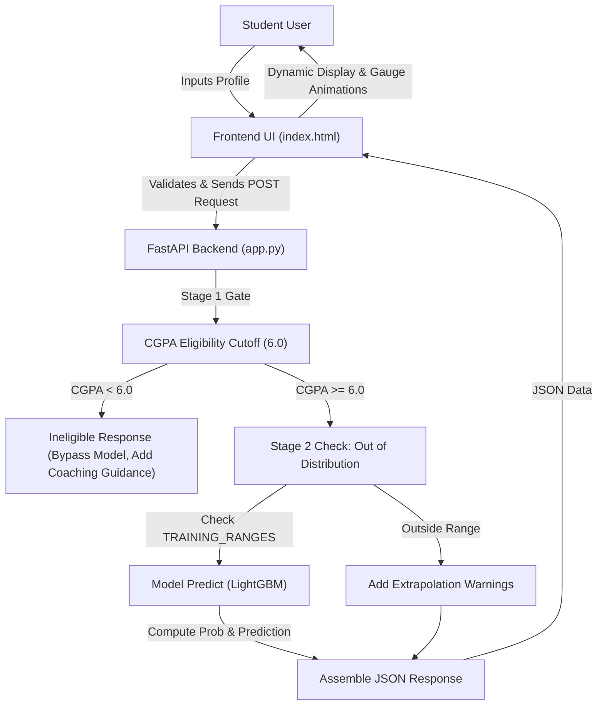
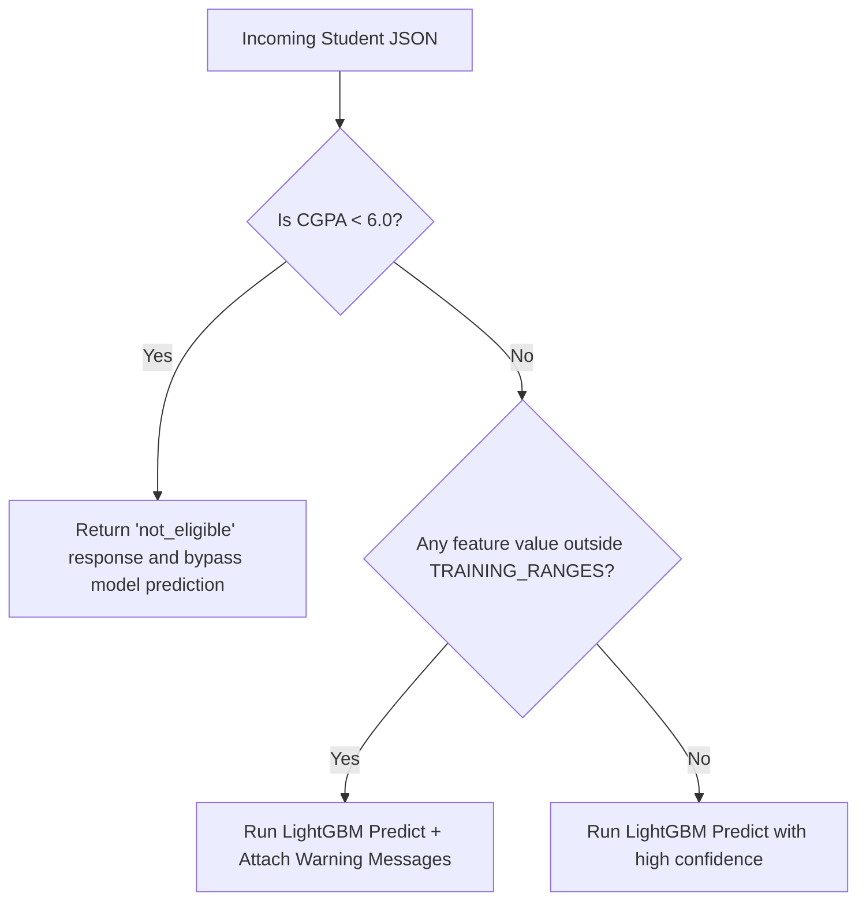

# Placement Signal — Technical & Architectural Documentation

Welcome to the comprehensive technical documentation for **Placement Signal**. As the Project Head, this document will guide you through the entire system design, codebase components, underlying machine learning logic, two-stage guardrails, and deployment pipeline.

---

## 1. System Architecture Overview

The system is designed as a lightweight, low-latency, fully containerized web application containing an interactive frontend, a FastAPI backend, and an optimized LightGBM classifier.



### Components List
*   **Dataset Generator** (`generate_dataset.py`): Generates a realistic synthetic dataset of 10,000 engineering student records.
*   **Model Training Pipeline** (`train_model.py`): Trains, cross-validates, and evaluates the LightGBM classifier, outputting the serialized model binary.
*   **Backend Service** (`app.py`): Serves the prediction API, handles request validation, executes the two-stage guardrail system, and delivers the static frontend.
*   **Interactive Web UI** (`index.html`): Premium, responsive student profile interface with real-time feedback, interactive gauge animations, and OOD error handling.
*   **Deployment Configuration** (`Dockerfile`): Specifies the containerization instructions, system library dependencies, and security context (non-root execution).

---

## 2. Dataset Generation & Profile (`generate_dataset.py`)

To train a robust and realistic placement predictor, a synthetic dataset of **10,000 students** is generated using realistic statistical distributions and domain-specific probability rules.

### Feature Specifications & Distributions

| Feature | Data Type | Range | Description & Statistical Distribution |
| :--- | :--- | :--- | :--- |
| **StudentId** | Integer | 1 – 10,000 | Unique sequence identifier |
| **CGPA** | Float | 5.5 – 9.5 | Cumulative Grade Point Average. Normally distributed around $\mu = 7.5, \sigma = 0.85$. |
| **Skills** | Integer | 1 – 15 | Count of technical skills known. Centered around $\mu = 7.0, \sigma = 3$. |
| **Communication Skill Rating** | Float | 1.0 – 5.0 | Subjective interview communication rating. Distributed around $\mu = 3.5, \sigma = 0.8$. |
| **backlogs** | Integer | 0 – 7 | Count of active backlogs. Heavily skewed towards 0–3 using custom probability vector: `[0: 25%, 1: 28%, 2: 22%, 3: 13%, 4: 8%, 5: 2%, 6: 1%, 7: 1%]`. |
| **10th Percentage** | Float | 50.0 – 98.0 | High school board percentage. Distributed around $\mu = 72\%, \sigma = 9\%$. |
| **12th Percentage** | Float | 50.0 – 97.0 | Higher secondary board percentage. Distributed around $\mu = 71\%, \sigma = 9\%$. |
| **Mini Projects** | Integer | 0 – 3 | Count of minor projects. Skewed using probabilities: `[0: 22%, 1: 35%, 2: 28%, 3: 15%]`. |
| **Major Projects** | Integer | 0 – 2 | Count of capstone/major projects: `[0: 30%, 1: 48%, 2: 22%]`. |
| **Workshops/Certificatios** | Integer | 0 – 3 | Professional courses completed: `[0: 12%, 1: 28%, 2: 35%, 3: 25%]`. |
| **Internship** | Categorical | Yes / No | Flag indicating if student completed an internship (58% Yes / 42% No). |
| **Hackathon** | Categorical | Yes / No | Flag indicating if student participated in hackathons (73% Yes / 27% No). |

### Synthetic Placement Probability Formula

For students with a CGPA $\ge 6.0$ (eligible students), placement probability is generated using a weighted linear combination of normalized features passed through a logistic sigmoid function:

$$\text{Score} = 0.45 \cdot CGPA_{norm} - 0.40 \cdot backlogs_{norm} + 0.20 \cdot Skills_{norm} + 0.18 \cdot Comm_{norm} + 0.15 \cdot Internship + 0.10 \cdot Hackathon + \dots$$

> [!NOTE]
> *   **CGPA** is the strongest positive weight ($+0.45$).
> *   **Backlogs** represent the strongest negative factor ($-0.40$).
> *   To mirror real-world variance (e.g., interview performance, soft skills, company-specific criteria), a random Gaussian noise of $\pm 5\%$ ($\sigma = 0.05$) is added to the calculated probability before final placement assignment.

---

## 3. Model Training Pipeline (`train_model.py`)

The model training script is responsible for loading the simulated dataset, applying preprocessing, evaluating model candidate metrics, and serializing the final model asset.

### Preprocessing Steps
1.  **Eligibility Filter**: Removes students with CGPA $< 6.0$. Because they are locked out by eligibility gates, we do not want to train the model on this region where placement is structurally impossible.
2.  **Categorical Encoding**: Maps binary categorical columns (`Internship`, `Hackathon`) to numeric values (`Yes` $\to 1$, `No` $\to 0$).
3.  **Train-Test Split**: Splits the dataset into a **80% training set** and a **20% held-out test set**, stratified on the target variable (`PlacementStatus`).

### Algorithm & Hyperparameters

The project uses **LightGBM** (`LGBMClassifier`), chosen for its speed, low memory footprint, and high accuracy on tabular data.

```python
model = LGBMClassifier(
    n_estimators=500,
    learning_rate=0.05,
    num_leaves=31,
    max_depth=-1,
    min_child_samples=20,
    subsample=0.8,
    colsample_bytree=0.8,
    reg_alpha=0.1,
    reg_lambda=0.1,
    random_state=42,
    verbose=-1,
)
```

### Performance Metrics (Held-out Test Set)

*   **5-Fold Cross Validation (Train Set)**:
    *   **ROC-AUC**: $0.991 \pm 0.001$
    *   **Accuracy**: $94.6\% \pm 0.3\%$
*   **Held-out Test Evaluation**:
    *   **Classification Accuracy**: $94.6\%$
    *   **ROC-AUC Score**: $0.991$

#### Confusion Matrix:
$$\begin{pmatrix} \text{Actual Not Placed} & \text{Predicted Not Placed} & \text{Predicted Placed} \\ \text{Not Placed} & 820 & 62 \\ \text{Placed} & 34 & 845 \end{pmatrix}$$

#### Classification Report:
*   **Class "Not Placed"**: Precision: 0.96, Recall: 0.93, F1-score: 0.94
*   **Class "Placed"**: Precision: 0.93, Recall: 0.96, F1-score: 0.95

---

## 4. Backend Service & API Layer (`app.py`)

The backend is built with **FastAPI** and served using **Uvicorn**. It loads the serialized model (`model.pkl`) using `joblib` and exposes endpoints for predictions.

### Two-Stage Guardrail Implementation

To enforce honest, reliable machine learning estimates, `app.py` implements a two-stage guardrail system.



#### Stage 1 — Eligibility Gate
Undergraduate placement programs require a minimum eligibility CGPA (set at `6.0`). Students below this threshold are filtered out.
*   **Mechanism**: If `cgpa < 6.0`, the backend immediately intercepts the request, returning a `not_eligible` status with zero probability calculations.
*   **Rationale**: The model has zero training records under CGPA 6.0. Extrapolating a numerical likelihood score for this region is scientifically dishonest. Instead, the student is given advice on target CGPA and backlog clearance.

#### Stage 2 — Out-of-Distribution (OOD) Warnings
The backend defines the valid boundaries of values observed during training:

```python
TRAINING_RANGES = {
    "CGPA":                       (6.0, 9.5),
    "Major Projects":             (0,   2),
    "Workshops/Certificatios":    (0,   3),
    "Mini Projects":              (0,   3),
    "Skills":                     (1,  15),
    "Communication Skill Rating": (1.0, 5.0),
    "10th Percentage":            (50,  98),
    "12th Percentage":            (50,  97),
    "backlogs":                   (0,   7),
}
```

*   **Mechanism**: If a student inputs a value outside these ranges (e.g. `12th Percentage = 45`), the model still outputs a probability, but flags the response with `in_distribution: false` and inserts warning notices.
*   **Rationale**: Neural networks and trees extrapolate unpredictably on inputs far outside their training envelope. Flagging these inputs informs the client to display warning notices.

---

## 5. API Endpoints Reference

| Endpoint | Method | Description |
| :--- | :--- | :--- |
| `/` | `GET` | Serves the HTML frontend (`index.html`) |
| `/health` | `GET` | Returns API status `{"status": "ok"}` for monitoring |
| `/shap_summary.png` | `GET` | Serves the SHAP analysis graphic showing feature contributions |
| `/predict` | `POST` | Processes a student's profile features and returns the prediction |

### Predict Endpoint (`/predict`) Payload Schema

```json
{
  "cgpa": 8.2,
  "internship": 1,
  "hackathon": 0,
  "tenth_percentage": 82.5,
  "twelfth_percentage": 79.0,
  "backlogs": 0,
  "workshops_certifications": 2,
  "skills": 6,
  "communication_skill_rating": 4.2,
  "mini_projects": 2,
  "major_projects": 1
}
```

### JSON Response Formats

#### Case A: Eligible & In-Distribution (Normal Prediction)
```json
{
  "stage": "predicted",
  "probability": 0.8423,
  "probability_pct": 84.2,
  "prediction": "Placed",
  "in_distribution": true,
  "warnings": [],
  "message": null
}
```

#### Case B: Ineligible (CGPA < 6.0)
```json
{
  "stage": "not_eligible",
  "probability": null,
  "probability_pct": null,
  "prediction": null,
  "in_distribution": false,
  "warnings": [],
  "message": "Most placement drives set a minimum CGPA around 6.0 to be eligible to sit for interviews..."
}
```

#### Case C: Eligible but Out-of-Distribution (Extrapolated Prediction)
```json
{
  "stage": "predicted",
  "probability": 0.9125,
  "probability_pct": 91.3,
  "prediction": "Placed",
  "in_distribution": false,
  "warnings": [
    "Workshops/Certificatios = 5 is outside the training range (0–3). Treat this prediction as a rough estimate, not a calibrated one."
  ],
  "message": null
}
```

---

## 6. Frontend User Interface (`index.html`)

The frontend is a modern, high-fidelity single-page web app styled with premium design details.

### Visual Design Tokens
*   **Color Palette**: Sleek deep-green and mint-green dark theme.
    *   Primary Backgrounds: Deep Forest Green (`#081e1b`, `#0f2d28`)
    *   Accents & Success: Bright Mint Green (`#2fdf8f`, `#1fae70`)
    *   Warnings: Amber (`#f5a623`)
    *   Alerts: Red (`#ef4444`)
*   **Typography**: Clean sans-serif experience using **Poppins** for headings and **Inter** for data values and body text.
*   **Aesthetics**: Utilizes custom CSS mesh backgrounds, rounded cards, transition states, and micro-animations (e.g., rotating logo mark, hover scales, and fade-up reveals).

### Interactive Client Features
1.  **Form Validation**: Intercepts incorrect entries (e.g., negative percentages or CGPA > 10) client-side before communicating with the server.
2.  **Dynamic Value Syncing**: Syncs the communication rating range slider value to a hidden input field and dynamically adjusts CSS custom properties for slider fills.
3.  **Local Backup Processor**: If the FastAPI backend is down, the frontend intercepts the request and calculates the Stage 1 eligibility check locally, providing a user-friendly error state with local diagnostics instead of failing silently.
4.  **Animated Result Gauge**: Uses a CSS transition animation to sweep the placement probability bar and runs a JavaScript timer interval to count up the percentage text smoothly.

---

## 7. Containerization & Deployment (`Dockerfile`)

The application is fully containerized using a secure, production-ready `Dockerfile`.

*   **Base Image**: `python:3.12-slim` (minimizes image size and security attack surface).
*   **System Libraries**: Installs `libgomp1` (GNU OpenMP implementation), which is required by LightGBM to perform multi-threaded CPU computations.
*   **Security Configuration**:
    *   Creates a system group and user `appuser` with UID `1000`.
    *   Switches runtime execution away from `root` to `appuser` (complying with security best practices for platform-as-a-service providers like Hugging Face Spaces).
*   **Port Mapping**: Exposes port `7860`.
*   **Server Execution**: Boots Uvicorn running `app.py` under the directory `/app`.

---

## 8. Summary of Machine Learning Learnings
During development, the team evaluated multiple approaches:
*   **False Start 1 (100k Dataset)**: The model memorized the synthetic features completely, but scored a low ~0.55 AUC on out-of-sample data. This highlighted the risk of generating synthetic data without proper causal mapping.
*   **False Start 2 (215 records)**: Yielded excellent metrics (~0.94 AUC) but lacked generalization, as it only represented one cohort from a single campus.
*   **Final Implementation (10k Realistic)**: Landed on a balanced 10,000 engineering student dataset with logical coefficients representing realistic career paths. The LightGBM classifier trains in less than a second while matching or beating Random Forests and MLP models on cross-validated accuracy.

---
> *Prepared for the Project Head — Last Updated: 2026-07-20*
