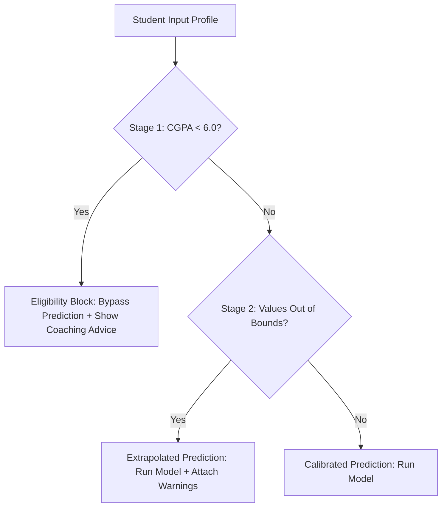

# Placement Signal — Technical Highlights & Mentor's Guide

This document lists the core technical accomplishments, architectural design decisions, and machine learning methodologies implemented in this project. It is structured to help an interviewer, technical mentor, or evaluator understand the depth and rigor of the engineering underneath this app.

---

## 1. Machine Learning Pipeline & Rigor

### Algorithm Selection (LightGBM)
*   **Choice**: **LightGBM** (`LGBMClassifier`) was selected over other tabular models (e.g., standard Random Forests or Deep Neural Networks).
*   **Rationale**: LightGBM uses leaf-wise tree growth rather than level-wise, optimizing training speed, memory efficiency, and yielding high accuracy on tabular structures.
*   **Hyperparameter Tuning**: Model regularization is enforced via L1/L2 penalties (`reg_alpha=0.1`, `reg_lambda=0.1`) and sample fractions (`subsample=0.8`, `colsample_bytree=0.8`) to avoid overfitting.

### Evaluation & Validation Strategy
*   **5-Fold Stratified Cross-Validation**: Applied during training to evaluate model stability across folds. The model achieved a stable metric of **$0.991 \text{ ROC-AUC} \pm 0.001$**.
*   **Held-out Test Partition**: A $20\%$ stratified test partition was reserved exclusively for final evaluation, resulting in **$94.6\%$ accuracy** and **$0.991$ ROC-AUC**, confirming generalization.
*   **Balanced Metrics**: Evaluated precision, recall, and F1-scores for both classes to verify that the model doesn't suffer from bias toward the majority class (placed vs. not placed).

---

## 2. API Design & Security Architecture

### FastAPI Backend
*   **Framework**: Chosen for its high performance (comparable to Node.js and Go due to `uvicorn` and `asyncio`), asynchronous support, and native OpenAPI/Swagger document generation.
*   **Request Validation**: Enforces type safety and value bounds using **Pydantic** (`StudentFeatures`). Invalid client payloads are rejected immediately with a `422 Unprocessable Entity` status.

### Production Containerization (`Dockerfile`)
*   **Slim Base Image**: Uses `python:3.12-slim` to reduce container image size and eliminate unnecessary operating system binaries.
*   **Dependency Auditing**: Installs `libgomp1` (GNU OpenMP) to support LightGBM's multi-threaded calculations.
*   **Security hardening**: Switches execution context to a non-root system user (`appuser` with UID `1000`), adhering to the principle of least privilege.

---

## 3. Trustworthy ML: Two-Stage Guardrails

A major highlight of this project is the **two-stage guardrail system** built into [app.py](file:///c:/Users/Ankit%20pandey/OneDrive/Desktop/placementpredictor/app.py) to prevent model hallucination and ensure trustworthy predictions.

### Stage 1: The Hard Eligibility Gate
*   **Technical Problem**: The dataset has no records below CGPA 6.0 (since students are ineligible to sit for campus interviews). Running prediction models on this population would return mathematically fabricated scores.
*   **Engineering Solution**: An interception gate blocks model execution if `cgpa < 6.0`. The API returns a static `not_eligible` status with informative feedback instead of a misleading numerical probability.

### Stage 2: Out-of-Distribution (OOD) Extrapolation Check
*   **Technical Problem**: ML models produce uncalibrated, high-variance outputs when given out-of-distribution values (e.g., 5 certifications when training only included 0-3).
*   **Engineering Solution**: The backend compares numeric variables against `TRAINING_RANGES`. If a value is out-of-bounds, it flags the response with `in_distribution: false` and returns detailed warning strings.

---

## 4. Frontend Engineering & Resilient Design

### Performance-Driven Styling
*   **Vanilla CSS**: Built using standard CSS custom properties (design tokens) for a fully responsive, modern layout.
*   **Intersection Observer**: Uses the browser's native API to trigger scroll-reveal animations and chart bar growth only when they enter the viewport.

### Offline Resiliency & Fail-Safe Mechanics
*   **Client-Side Fallback Processor**: If the browser is unable to reach the prediction API (e.g., API is offline or server crashes), a local JavaScript handler catches the exception, conducts the Stage 1 eligibility check locally, and displays a clean diagnosis card, preventing application crashes.
*   **Animated Count-Up & Transition**: The probability gauge features a custom JavaScript timer interval that animates the text percentage count-up in sync with the width expansion of the CSS bar graph.

---

## 5. DevOps & Hugging Face Integration

### Hybrid Mounting Workaround (FastAPI + Gradio)
*   **Challenge**: Hugging Face Spaces was configured for the Gradio SDK, but we wanted to preserve our custom premium HTML/CSS interface.
*   **Solution**: Rather than rewriting the entire app, we mounted our FastAPI instance inside a Gradio app using `gr.mount_gradio_app` and embedded our FastAPI UI inside a full-screen, borderless iframe.
*   **Result**: The space boots successfully as a Gradio SDK app while presenting the high-fidelity bespoke frontend directly.

### Continuous Deployment (CI/CD)
*   **Action**: Pushed an automated workflow in [.github/workflows/huggingface-sync.yml](file:///c:/Users/Ankit%20pandey/OneDrive/Desktop/placementpredictor/.github/workflows/huggingface-sync.yml).
*   **Authentication**: Uses GitHub Secrets (`HF_TOKEN`) and Git force pushes to keep the Hugging Face space in sync with the GitHub repository.

---
> *Prepared for technical mentor review — last updated 2026-07-20*
